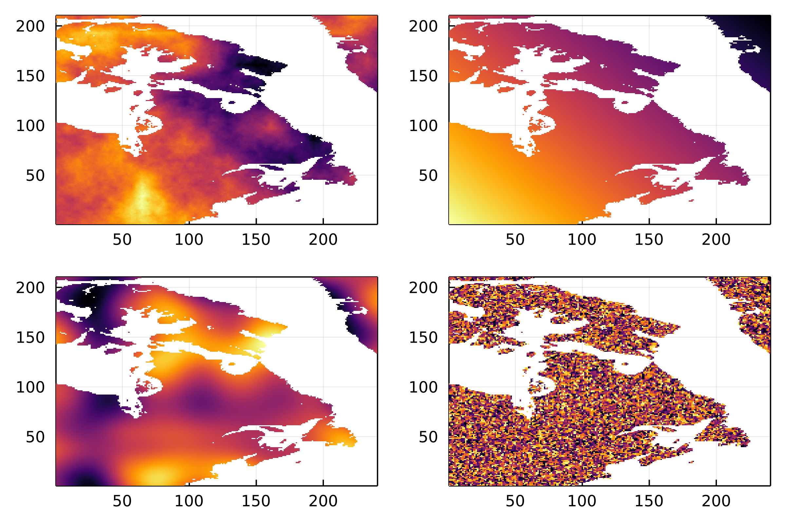
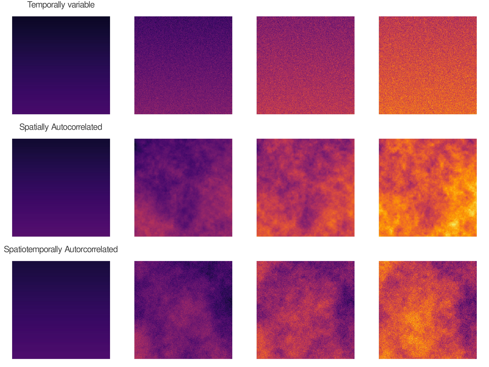
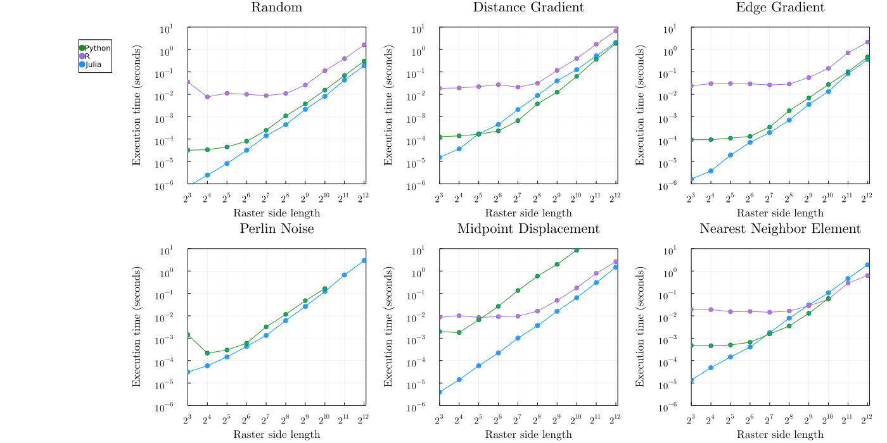
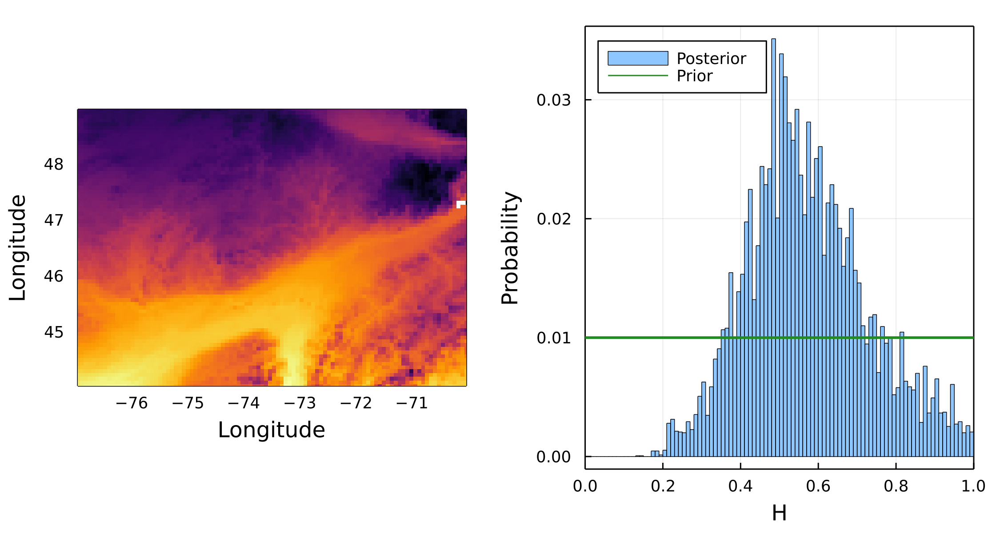

# Introduction

- what are neutral landsacpes

Neutral landscapes are increasingly used in ecological and
evolutionary studies to provide a null expectation spatial variation
of some measurement.

Originally based around methods for simulating
spatially autocorrelated data [@Gardner1987NeuMod; @Milne1992SpaAgg].

whawt is spaital autocorrelation

they have seen use in a wide range of fields in ecology and evolution:
from landscape genetics [@Storfer2007PutLan], to landscape and spatial
ecology [@Tinker2004HisRan; @Remmel2013CatCla], and biogeography
[@Albert2017BarDis].


 The two most popular libraries used to simulate neutral landscapes
are `NLMR` in (the `R` language) [@Sciaini2018NlmLan] and `NLMpy` [in
Python; @Etherington2015NlmPyt]. Here we present
`NeutralLandscapes.jl`, a package for neutral landscape simulation in
the `Julia` language.   So, why another package?  Here we demonstrate
that `NeutralLandscapes.jl` is orders of magnitude faster than
previous neutral landscape packages. In addition,
`NeutralLandscapes.jl` implements several novel methods for simulating
environmental change with temporal variation.

As biodiversity science becomes increasingly concerned with temporal
change and its consequences, its clear there is a gap in methodology
in generating neutral landscapes that change over time.   Our model
allows users to simulate time-series of any `NeutralLandscape` layer,
and which produce an arbitrary distribution of change across every
spatial cell, with provided levels of spatial and temporal
autocorrelation.

# Software Overview

This software can generate neutral landscapes using several methods,
enables masking and works with other julia packages.

@fig:allmethods shows a replica of Figure 1 from
@Etherington2015NlmPyt, which shows the capacity of the library to
generate different types of neutral landscapes, and then apply masks
and categorical classifcation to them.

{#fig:allmethods}


Further, `NL.jl` provides methods for interacting with other `julia`
packages, and functions for rescaling

## Interoperability

Ease of use with other julia packages

Mask of neutral variable masked across quebec in 3 lines.

```
using NeutralLandscapes
using SimpleSDMLayers

quebec = SimpleSDMPredictor(WorldClim, BioClim; left=-90., right=-50., top=75., bottom=40.)
qcmask = fill(true, size(quebec))                   # ------ TODO
qcmask[findall(isnothing, quebec.grid)] .= false    # should both of these lines be possible only using mask?

pltsettings = (cbar=:none, frame=:box)

plot(
    heatmap(rand(MidpointDisplacement(0.8), size(layer), mask=qcmask); pltsettings),
    heatmap(rand(PlanarGradient(), size(layer), mask=qcmask); pltsettings),
    heatmap(rand(PerlinNoise((4,4)), size(layer), mask=qcmask); pltsettings),
    heatmap(rand(NearestNeighborCluster(0.5), size(layer), mask=qcmask); pltsettings),
    dpi=400
)
```



## Rescaling to mimic real data


Figure: Real temp (left) / Rescaled NL (right) , same unit bar

## Generating dynamic neutral landscapes

We implement methods for generating change that are temporally
autocorrelated, spatially-autocorrelated, or both.

$M_t = M_{t-1} + f(M(t-1))$

## Models of change

Two types of temporal change: (1) null change, where the is random
variation in each cell across time but the mean value across all cells
stays constant (with some variation around this constant due to
randomness in change generation)

### Null

Take an arbitrary distribution (from `Distributions.jl`) and set its
mean value to 0, and apply draws from that distribution to each cell
at each timestep.

### Directional

Can take an arbitrary distribution of values and set its expected-value
to be the primary input into a change model---the mean amount of change
at each timestep. This can also be parameterized to a be a variable list of
mean change at each corresponding timestep.

#### Temporally autocorrelation

We generate temporally autocorrelated change using the method. We take
an arbitrary distribution $A$

$r$: rate, $v$: variability, $U$ matrix of draws from standard $\text{Normal}(0,1)$.
Here $v$ replects the amount of temporal autocorrelation.

The value of a given cell $(i,j)$ with value $M_{ij}$
$$M_{ij}(t+1) = f_{T}(M_{ij}(t)) = r + vA_{ij}$$

Results in an expected value of change of $r$ per timestep with variance $v$.

#### Spatial autocorrelation

Generate a matrix $\delta$ with a NL generator.

$r$: rate, $v$: variability, $[Z(\delta)]_{ij}$: the $(i,j)$ entry of the z-score of the $\delta$ matrix

Z-score is arbitrary and can be replaced with any dist.

$f_{S}(M_{ij}) = r + v \cdot [Z(\delta)]_{ij}$

#### Spatiotemporal autocorrelation

Finally, to implement change this is both spatially and temporally autocorrelated

$f_{ST}(M_{ij}) = r + v \cdot [Z(\delta)]_{ij}$



# Benchmark comparison to `nlmpy` and `NLMR`

It's fast. As the scale and resolution of raster data increases,
neutral models must be able to scale to match those data dimensions.




How many lines of code, and what language is that code in for each
pkg? `NLMR` contains 893 lines of R, and 376+51 lines of C++. `nlmpy`
contains 386 lines of python. Julia contains 664 lines of (non-test)
`julia`. Note these numbers refer only to lines of code and not
comments.

# Example: fitting a neutral landscape to an empirical spatial dataset

Here we use approximate bayesian computation to estimate the parameter of autocorrelation H for an empirical raster of temperature data.

Why? What if we are interested in differentiating the processes that occur
in this _real_ landscape versus landscapes with _similar statistical
properties_.

We take a raster of mean temp around the st lawrence lowlands in QC, and use ABC to estimate the value of H under the midpoint-displacement model.

We use the variogram as the loss function

{#fig:post}

# Discussion

Why is it good that we've made this a faster thing to do?
Why are models of temporal change necessary?
What can simulation do for spatial ecology more generally?

What are questions we can address with NL.jl that was not possible before?

# References
