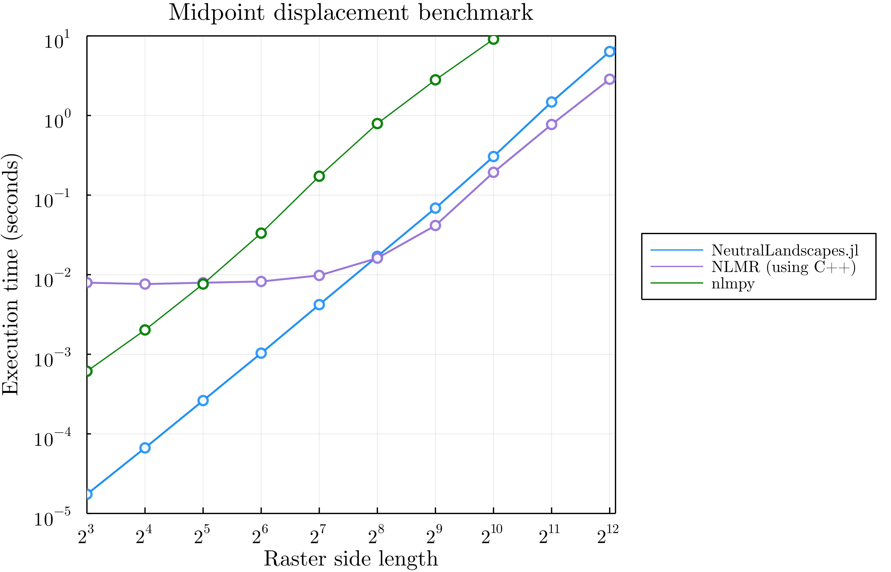

# Introduction

Neutral landscapes are increasingly used in ecological and evolutionary studies to provide a 
null expectation of the variance of a given metric over space.

Wide range of disciplines: from landscape genetics [], to spatial ecology [], and biogeography [].

As biodiversity science becomes increasingly concerned with temporal change
and its consequences, its clear there is a gap generating neutral landscapes
that change over time. In this ms we present how `NeutralLandscapes.jl` is
orders of magnitudes faster than packages `nlmpy` (in python) or `NLMR` (in R).
In addition we then present a novel method for generating landscape change with prescribed 
levels of spatial and temporal autocorrelation.

# Software Overview

This software can generate neutral landscapes using several methods, enables 
masking and works with other julia packages.

@fig:allmethods shows a replica of Figure 1 from @nlmpycite, which shows the 
capacity of the library to generate different types of neutral landscapes,
and then apply masks and categorical classifcation to them.

Table of methods.

In

{#fig:allmethods}

## What methods have been called different things but are actually the same thing?

## Interoperability

Ease of use with other julia packages

Mask of neutral variable masked across quebec in 3 lines.

# Benchmark comparison to `nlmpy` and `NLMR`

It's fast. As the scale and resolution of raster data increases, neutral models must be able to scale to match
those data dimensions. 
Here we provide two benchmark tests.
First a comparison of the speed variety of methods from each `NeutralLandscapes.jl`, 
`NLMR`, and `nlmpy`.
Second we compare these performance of each of these software packages as rasters become larger. We show that 
`Julia` even outperforms the `NLMR` via C++ implemention of a particularly slow neutral landscape method (midpoint displacement). 

**Fig 2**: Benchmark comparison of selected methods in each of the three languages

In fig 2 we should a selection of neutral landscape generators (random, edge gradient, perlin noise, distance-gradient)

## MPD comparison

Why use this particular generator as the comparison? It's slow. So slow that NLMR
implements it in C++. (NLMR implements both MPD, neighbor, randrect, and random neighboorhood in c++).  Still these three algorithms,
which cosinsts of 3/16 of NLMR's alg implementations, constitute 33% of its codebase.

In this section we show our implementation of MPD is faster than NLMR's C++ MPD scales until
the  asyptotic limit imposed by the $O(n^2)$ scaling of the raster

# Generating dynamic neutral landscapes

We implement methods for generating change that are temporally autocorrelated,
spatially autocorrelated, or both.

$M_t = f(M_{t-1})$

# Discussion 

# References

